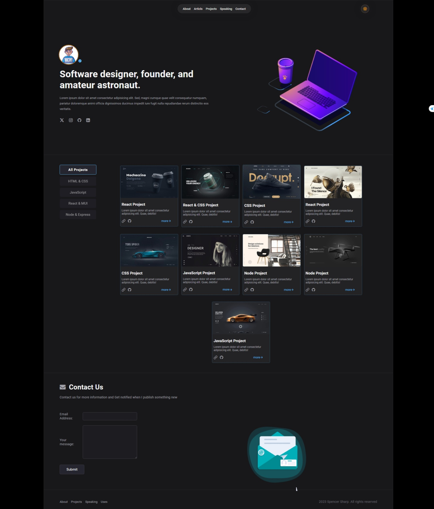

# Code Gallery

<p align="center">
  
</p>

## HOME PAGE

<p align="center">
  
</p>


## Table of Contents

- [Introduction](#introduction)
- [Features](#features)
- [Technologies Used](#technologies-used)
- [Prerequisites](#prerequisites)
- [Getting Started](#getting-started)
- [Usage](#usage)
- [Folder Structure](#folder-structure)

## Introduction

**Code Gallery** is a personal portfolio web application showcasing various coding projects. It provides an organized display of projects, allowing users to filter and view projects based on different categories such as HTML & CSS, JavaScript, React & MUI, and Node & Express.

## Features

- **Filter Projects:** View projects based on categories like HTML & CSS, JavaScript, React & MUI, and Node & Express.

- **Animated Presentation:** Projects are presented with smooth animations using the Framer Motion library.

- **Responsive Design:** The application is designed to be seamlessly accessible on various devices.

## Technologies Used

- **Frontend:** React, Framer Motion, Lottie

- **Styling:** CSS

## Prerequisites

- [Node.js and npm](https://nodejs.org/): Ensure that Node.js and npm are installed on your machine.

## Getting Started

1. **Clone the repository:**
   ```sh
   git clone <repository-url>
2. **Navigate to the project directory:**
   ```sh
    cd portfolio_website
3. **Install dependencies:**
   ```sh
    npm install
4. **Start the application:**
   ```sh
    npm run dev

## Usage

- **Explore Project Repositories:**
  - Browse through different project categories.
  - Each project title serves as a link to the respective GitHub repository.

- **Contact the Developer:**
  - Visit the "Contact Us" section to get in touch.
  - Provide your email address and a message.
  - Click the "Submit" button to send an email to the developer.
  - A success message will be displayed upon successful submission.


## Folder Structure

  - public
      - fonts
      - images
  - src
    - animation
    - components
      - header
      - hero
      - main
      - contact
      - footer
